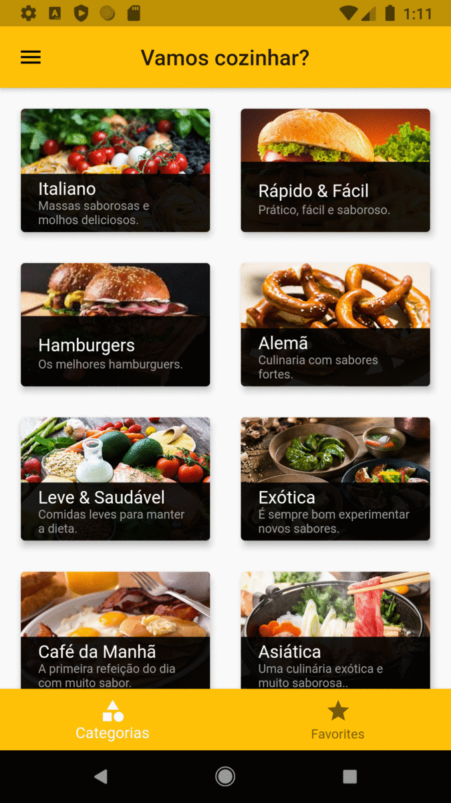

# Meals
## Flutter Learn

### Português

Meals é uma aplicação para receitas.  O foco desse módulo é aprender sobre técnicas de navegação.

O que eu aprendi:
- Routes
- Drawer Navigation
- TabNavigation
- Replaced Screen
- Separação de responsábilidades
- A necessidade do gerenciamento de estado

## Demo

## License

MIT
